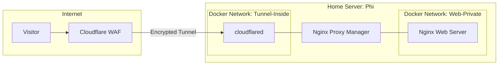

# Hardened Self Hosted Web Infrastructure

## Overview
This project is a study in **network isolation and defensive systems.** Instead of using traditional hosting, I host my personal website on my local hardware (**'Phi'**) using a multi layered Docker environment. 

The goal was to achieve a professional website for **€0** while maintaining basically zero trust. By using Cloudflare Tunnels and strict Docker networking, I have exposed the site to the public internet without opening a single port on my home router!

## The "gatekeeper" architecture
I utilize a "Need to Know" networking model. Even though services reside on the same physical host, they are isolated at the bridge level to prevent lateral movement.

### Network Flow:
1. **Public Layer**: Traffic hits the `eu.org` domain, proxied through Cloudflare.
2. **Tunnel Layer**: The `cloudflared` container establishes an outbound connection. It sits on **Network A**.
3. **Proxy Layer**: **Nginx Proxy Manager (NPM)** acts as the sole bridge. It is the only container with interfaces on both **Network A** and **Network B**.
4. **Application Layer**: The Nginx web server sits on **Network B**. It has no direct path to the tunnel or the outside world.

## Key technical implementation

### 1. Advanced segmentation
To ensure maximum security, I configured the `docker-compose.yml` to define strictly separate networks. 

* **The isolation**: The `cloudflared` container and the website container cannot communicate directly.
* **The bridge**: Traffic must be brokered through the **NPM**, allowing me to inspect and control flow between the two segments.

### 2. Firewall hardening
I modified my host's **UFW** to ensure:

* **Internal routing only**: Nginx is restricted to internal Docker network traffic.
* **No open ports**: Since I use a Cloudflare Tunnel, I have **0 open ports** on my router. This effectively "cloaks" my home IP from potential botnets and scanners.

### 3. SSL and edge security
* **Domain**: Secured a free community TLD via `eu.org`.
* **Encryption**: Implemented full SSL/TLS Let's Encrypt.

---

## Technical Toolkit

| Component | Choice | Purpose |
| :--- | :--- | :--- |
| **Domain** | `eu.org` | Permanent €0 TLD. |
| **Tunnel** | `cloudflared` | Eliminates the need for port forwarding. |
| **Proxy** | Nginx Proxy Manager | Centralized traffic brokering and SSL management. |
| **Web Server** | Nginx (Alpine) | Lightweight, hardened container for static content. |
| **Backend** | Rust | Secure, memory safe, fast and fun to code. |
| **Security** | UFW / Cloudflare | Multi layer perimeter defense. |

---

> **SOC Analyst Perspective**: This project demonstrates my ability to manage the **"Attack surface."** By treating a simple website as a high-security asset, I practiced the core principles of defensive networking: **isolation**, **least privilege**, and **encrypted transport**.
